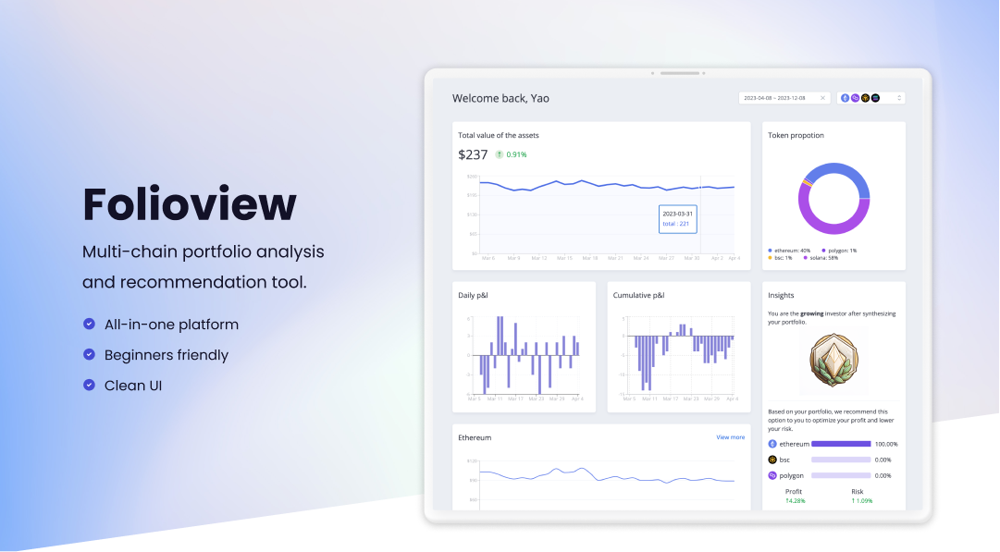

# FolioView

## Introduction
- This project is an all-in-one multi-wallet information aggregation and data analysis tool designed for DeFi beginners, aiming to lower the entry barrier for new Web3 users participating in DeFi activities.
- It provides a clean and user-friendly dashboard interface, supporting balance, revenue, and distribution queries for mainstream assets.
- By analyzing the user's on-chain asset allocation data and combining it with market data, a user profile reflecting their risk tolerance is built, and SBT is minted accordingly for displaying their decentralized identity (DID) on social media for C-end users, as well as providing a on-chain asset label data for B-end organizations.
- Using quantitative statistical models, the platform recommends optimal investment portfolios for users based on their current asset allocation, and offers risk/reward comparisons with their existing portfolio, providing reference for users' investment decision-making to optimize their asset allocation.
- It also provides secondary information aggregation pages for various assets, including real-time token prices, latest airdrop events, token news updates, and the most recent opinions from Top Chinese KOLs on Twitter regarding the specific token.

## Getting Started

First, run the python server (Make sure you have installed dependencies properly):
```bash
python ./server.py
```
This server is running on [http://localhost:5000](http://localhost:5000).

Then, run the development server:
```bash
npm run dev
# or
yarn dev
```

Open [http://localhost:3000](http://localhost:3000) with your browser to see the result.


## Note
- mock data are located at `src/data`
- nft contracts and deployment configuration are located at `nft/`
- Front-end related environment variables and contract address are located under the `env` field in `next.config.js`'